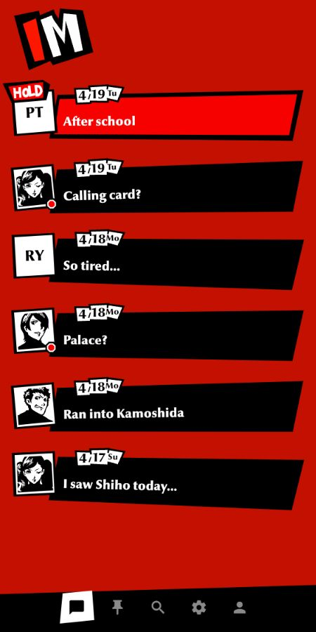
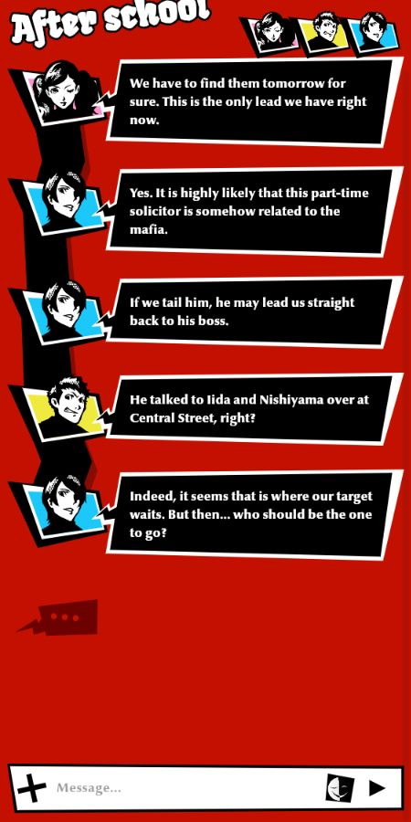
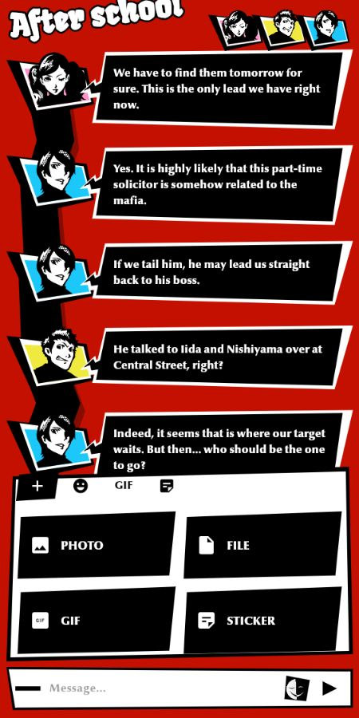

<div align="center">
  

  # IM

  **A Persona 5-inspired messenger interface built with Flutter.**

  Expressive conversations, crooked panels, animated portraits and a sharp
  red-black-white visual language in a cross-platform Telegram client prototype.

  [](https://flutter.dev)
  [](https://dart.dev)
  [](#build)
  [](#project-status)
</div>

## Preview

<p align="center">
  
  
  
</p>

## Highlights

- Persona-inspired chat list with pinned, new, hold and selected states
- `NEW` badge for incoming unread messages
- `HOLD` badge for chats that still need your reply
- Online and offline mock states
- Animated message bubbles, portraits and connecting lines
- Text, photo and file messages
- Emoji picker, GIFs, static stickers and video stickers
- Native Android photo and file pickers
- Global search mockup for chats, people, groups and channels
- Adaptive Android launcher icon and platform-specific app icons
- Repository abstraction prepared for a future TDLib backend

## Feature status

| Area | Status | Notes |
| --- | --- | --- |
| Chat list | Ready | Mock chats, pinned filter, NEW/HOLD state |
| Conversation UI | Ready | Animated local transcript |
| Attachments | Ready | Photos, files, emoji, local GIFs and stickers |
| Search | Prototype | Local and discovery mock results |
| Presence | Prototype | Online and offline placeholders |
| Profile and settings | WIP | Deliberate placeholder screens |
| Telegram backend | Planned | TDLib scaffold only |
| Automated tests | Planned | Manual Android and Web verification |

## Mock and fallback states

The app is usable before Telegram is connected. `MockChatRepository` supplies
stable data for the visual states that the real backend will eventually drive:

- direct chat, group chat and channel-like chat;
- online and offline presence;
- pinned and unpinned chats;
- unread counts, the `NEW` marker and reply-needed `HOLD` marker;
- chats with portraits and chats with generated letter avatars;
- image, file, GIF and sticker messages;
- visible fallbacks for missing avatars and unavailable sticker media.

These states are intentionally centralized in the models so TDLib data can
replace the mock values without redesigning the widgets.

## Run locally

### Requirements

- Flutter `3.41.6` or a compatible newer stable version
- Dart `3.11.4` or a compatible newer version
- A configured Android, iOS, desktop or Web target

### Setup

```bash
git clone https://github.com/Luciffio/IMFlutter.git
cd IMFlutter
flutter pub get
flutter run
```

Choose a specific target when needed:

```bash
flutter run -d chrome
flutter run -d windows
flutter run -d android
```

## Project structure

```text
lib/
|-- main.dart                  # App shell and navigation
|-- models/                    # Chat and message state
|-- services/                  # Mock and Telegram repositories
|-- theme/                     # Persona color palette
`-- widgets/
    |-- chat_list_screen.dart  # Chat list and bottom navigation
    |-- transcript.dart        # Conversation layout and animations
    |-- input_bar.dart         # Message input
    |-- composer_panel.dart    # Attachments, emoji, GIFs and stickers
    `-- file_bubble.dart       # Persona-style file message

assets/
|-- icons/
|-- images/
|-- portraits/
`-- stickers/
```

## Backend architecture

The current build uses `MockChatRepository`, so it launches without an account,
API keys or a server. `ChatRepository` isolates the UI from the transport layer.

`TelegramRepository` is backed by TDLib through `handy_tdlib`, but it is opt-in
while the integration is still being stabilized. Mock mode remains the default.

Run the TDLib spike with Telegram API credentials from
[my.telegram.org](https://my.telegram.org):

```bash
flutter run -d android \
  --dart-define=USE_TELEGRAM=true \
  --dart-define=TG_API_ID=123456 \
  --dart-define=TG_API_HASH=your_api_hash
```

The first backend target is intentionally small: authorization, chat list,
history for one chat and text sending.

## Roadmap

1. Stabilize TDLib authorization on Android devices.
2. Replace mock chats, presence and unread counters with Telegram updates.
3. Connect global search, pinned chats and media history.
4. Upload photos, files, GIFs and stickers through Telegram.
5. Replace the profile and settings WIP screens.
6. Add release signing, CI builds and widget tests.

## Build

```bash
flutter analyze
flutter build apk --release
flutter build web
```

Desktop and iOS builds depend on the host operating system and installed
toolchains.

## Disclaimer

This is an unofficial fan-made project created for learning and experimentation.
Persona and related visual properties belong to their respective owners. The
project is not affiliated with or endorsed by Atlus or SEGA.
